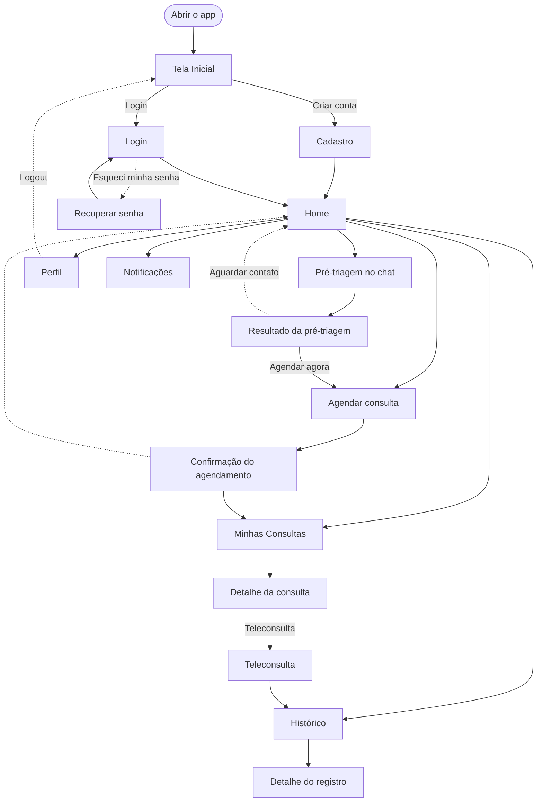
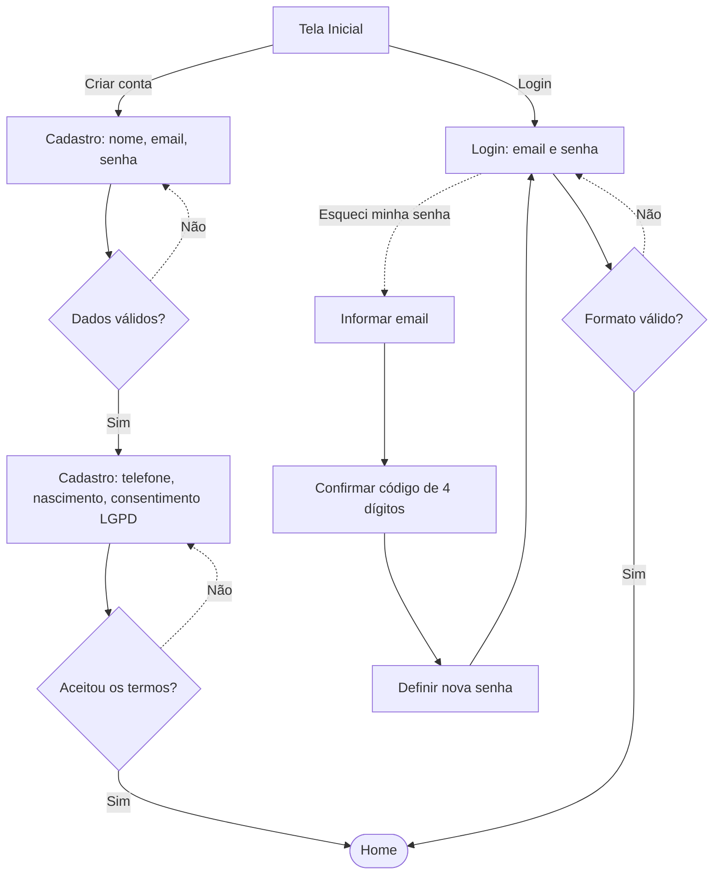
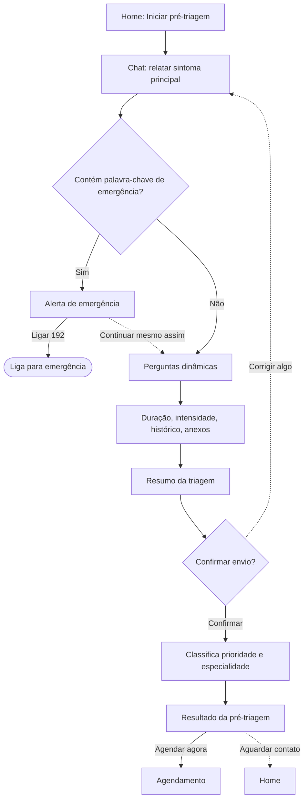
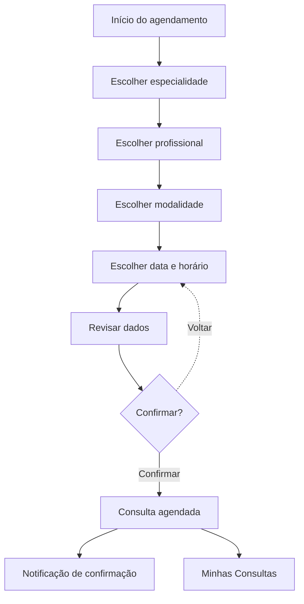
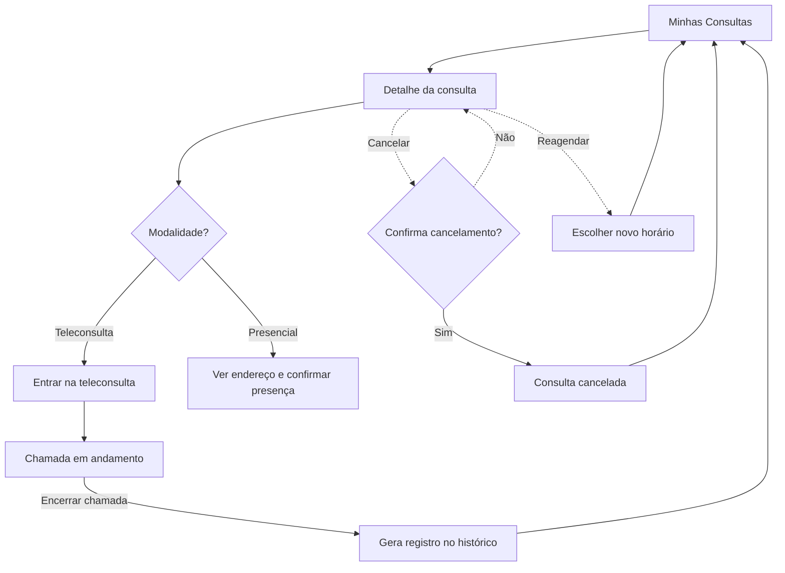

# V.I.T.A. - Diagrama de Fluxo de Interação

Validação Inteligente de Triagem e Atendimento

## Introdução

Este documento apresenta o diagrama de fluxo de interação do V.I.T.A., mostrando como o paciente navega entre as telas e funcionalidades do sistema. Os diagramas indicam os principais caminhos de uso, pontos de decisão, entradas e saídas, alternativas e exceções da interação.

O fluxo foi construído a partir do [Mapa de Jornada do Usuário](Mapa-de-Jornada-do-Usuario.md) e reflete diretamente a navegação já implementada no protótipo de alta fidelidade (pasta `app/`).

## Legenda

| Símbolo | Significado |
|---|---|
| `(( ))` ou `[ ]` arredondado | Início ou fim de um fluxo |
| `[ ]` retângulo | Tela ou ação do sistema |
| `{ }` losango | Ponto de decisão |
| Seta contínua | Caminho principal |
| Seta tracejada | Caminho alternativo ou exceção |

## Visão Geral da Navegação

## Fluxo de Autenticação

Entradas: nome, e-mail, senha, telefone, data de nascimento, código de verificação. Saídas: conta criada e usuário autenticado (Home) ou senha redefinida (volta ao Login). Exceções: e-mail em formato inválido, senha curta, consentimento LGPD não marcado, código de verificação incorreto.

## Fluxo de Pré-Triagem (Chat)

Entradas: texto livre do sintoma, respostas rápidas ou digitadas, anexo simulado de exame. Saídas: resultado com prioridade e especialidade recomendada. Alternativa: responder por botão de resposta rápida em vez de digitar. Exceção: detecção de emergência interrompe o fluxo normal antes das perguntas de aprofundamento.

## Fluxo de Agendamento

Entradas: especialidade, profissional, modalidade (teleconsulta ou presencial), data e horário. Saída: consulta agendada e visível em Minhas Consultas. Alternativa: chegar nesta tela já com a especialidade pré-selecionada, vindo do resultado da pré-triagem. Exceção: nenhum horário disponível bloqueia o avanço até uma data ser escolhida.

## Fluxo de Gestão de Consultas

Entradas: escolha de novo horário, confirmação de presença. Saídas: consulta concluída (gera registro no histórico), cancelada ou reagendada. Exceção: cancelamento sempre passa por uma confirmação antes de ser efetivado, para evitar perda acidental do agendamento.

## Exceções e Casos Transversais

| Situação | Comportamento do sistema |
|---|---|
| Acessar uma rota protegida sem estar logado | Redireciona automaticamente para o Login |
| Acessar uma rota que não existe | Mostra a tela "Página não encontrada" com botão de volta para o Home |
| Login ou cadastro com dados em formato inválido | Mensagem de erro inline, sem sair da tela |
| Cadastro sem marcar o consentimento LGPD | Bloqueia o avanço e explica o motivo |
| Sintoma com palavra-chave de emergência no chat | Interrompe o fluxo normal e abre o alerta de emergência |
| Cancelar uma consulta | Exige confirmação antes de efetivar |
| Sem consultas, notificações ou histórico | Mostra estado vazio com texto orientativo, sem quebrar a tela |

## Mapeamento de Telas e Rotas

| Tela | Rota | Componente |
|---|---|---|
| Tela Inicial | `/` | `Splash.tsx` |
| Cadastro | `/cadastro` | `Signup.tsx` |
| Login | `/login` | `Login.tsx` |
| Recuperar senha | `/recuperar-senha` | `ForgotPassword.tsx` |
| Home | `/home` | `Home.tsx` |
| Chat de pré-triagem | `/triagem` | `TriageChat.tsx` |
| Resultado da pré-triagem | `/triagem/resultado` | `TriageResult.tsx` |
| Agendamento | `/agendamento` | `Scheduling.tsx` |
| Confirmação do agendamento | `/agendamento/confirmacao` | `ScheduleConfirmation.tsx` |
| Minhas Consultas | `/consultas` | `AppointmentsList.tsx` |
| Detalhe da consulta | `/consultas/:id` | `AppointmentDetail.tsx` |
| Teleconsulta | `/consultas/:id/teleconsulta` | `Teleconsult.tsx` |
| Perfil | `/perfil` | `Profile.tsx` |
| Histórico | `/historico` | `HistoryList.tsx` |
| Detalhe do histórico | `/historico/:id` | `HistoryDetail.tsx` |
| Notificações | `/notificacoes` | `Notifications.tsx` |
| Página não encontrada | `*` | `NotFound.tsx` |

## Fontes

- Mapa de Jornada do Usuário;
- Requisitos Funcionais em User Stories e Requisitos Não Funcionais;
- Protótipo de Alta Fidelidade (pasta `app/`).
