# Diagramas de Atividades (UML) - Sistema V.I.T.A

Documento gerado com base nos Casos de Uso descritivos (Módulo 1 - Acesso, Módulo 2 - Triagem, Módulo 3 - Atendimento), nos Requisitos Funcionais (RF), nos Requisitos Não Funcionais (RNF), no Diagrama de Casos de Uso (UCD) e no protótipo/código-fonte do sistema (`app/src`). Segue o mesmo padrão visual da página "Diagrama de Fluxo de Interação": setas contínuas para o caminho principal e setas tracejadas para caminhos alternativos ou de exceção.

## Legenda

| Símbolo | Significado |
|---|---|
| `([ ])` arredondado | Início ou fim de um fluxo |
| `[ ]` retângulo | Ação do usuário ou do sistema |
| `{ }` losango | Ponto de decisão |
| Seta contínua | Caminho principal |
| Seta tracejada | Caminho alternativo ou exceção |

## Inconsistências identificadas e decisões adotadas

Antes de modelar os diagramas, foram identificadas divergências entre as fontes fornecidas. Em todos os casos, prevaleceu a **especificação descritiva dos Casos de Uso** (fonte primária, conforme ordem de prioridade definida), com a divergência registrada abaixo para rastreabilidade:

1. **Numeração dos Casos de Uso**: o Diagrama Geral de Casos de Uso (UCD) enumera UC01-UC22, enquanto a "Especificação dos Casos de Uso Descritivos" enumera UC01-UC29, dividida em 3 módulos. Foi adotada a numeração da especificação descritiva (UC01-UC29) por ser a fonte mais detalhada e granular (inclui, por exemplo, UC07 a UC09 e UC13 a UC20 como casos independentes, que no UCD aparecem apenas como sub-bolhas `<<include>>`/`<<extend>>`).
2. **UC02 - Realizar Login (MFA/OTP)**: a especificação exige autenticação em dois fatores (MFA) e notificação de login em novo dispositivo. O protótipo atual (`AuthContext.tsx`) implementa apenas autenticação por e-mail/senha, com bloqueio brando após 2 tentativas incorretas, **sem MFA e sem notificação de novo dispositivo**. Optou-se por modelar o fluxo **conforme a especificação** (mais completa e alinhada às RNF de segurança RNF-SEG-01/04/05), pois representa o comportamento-alvo do sistema; a lacuna de implementação foi sinalizada no diagrama.
3. **UC06 - Consultar Histórico Individual de Acessos**, **UC10/UC11/UC12 (Administrador)**, **UC19/UC20/UC26-UC29 (Médico)**: nenhuma dessas telas está implementada no protótipo atual, pois a aplicação React em `app/src` cobre exclusivamente o fluxo do **Paciente** (não há campo `role` no modelo de usuário nem rotas para Médico/Administrador). Os diagramas foram modelados **integralmente a partir da especificação de Casos de Uso**, já que representam requisitos formalmente definidos ainda não prototipados. Isso é sinalizado individualmente em cada UC afetado.
4. **UC15 - Pausar Triagem**: a especificação prevê pausa/retomada da sessão de pré-triagem. O protótipo (`TriageChat.tsx`) implementa um fluxo linear, sem persistência de pausa. O diagrama segue a especificação, com a lacuna sinalizada.
5. **UC05 - Alterar Senha**: não há tela de alteração de senha no protótipo (`Profile.tsx` não possui essa opção). O diagrama segue a especificação.

Nenhuma funcionalidade foi inventada além do que consta nos Casos de Uso, RFs/RNFs ou no protótipo.

---

# Módulo 1 - Gestão de Acesso, Autenticação, IAM e Governança LGPD

# UC01 - Criar Conta

## Resumo

- **Objetivo:** Permitir que o paciente crie uma conta no sistema, informando dados cadastrais e consentimento LGPD.
- **Ator:** Paciente (principal); Sistema (secundário).
- **Fluxo principal:** Paciente preenche formulário → sistema valida dados → verifica duplicidade de CPF/e-mail → apresenta Termo de Privacidade → paciente consente → sistema cria a conta.
- **Fluxos alternativos:** Correção de dados inválidos (FA01); cancelamento do cadastro antes da conclusão (FA02).
- **Exceções:** Cadastro já existente (FE01); consentimento recusado (FE02); falha na persistência dos dados (FE03).

## Diagrama em Mermaid

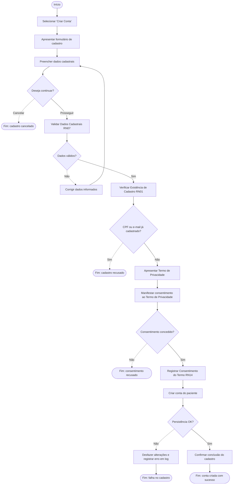

---

# UC02 - Realizar Login

## Resumo

- **Objetivo:** Autenticar o usuário mediante credenciais e segundo fator (MFA), criando uma sessão válida.
- **Ator:** Usuário (principal); Sistema, Serviço de Autenticação MFA, Serviço de Notificação (secundários).
- **Fluxo principal:** Usuário informa credenciais → sistema valida → solicita e valida código MFA → cria sessão → carrega permissões (RBAC) → registra acesso.
- **Fluxos alternativos:** Login em novo dispositivo notificado por e-mail (FA01); sessão já ativa é restaurada (FA02).
- **Exceções:** Usuário inexistente (FE01); senha inválida (FE02); conta bloqueada (FE03); código MFA inválido/expirado (FE04); excesso de tentativas → bloqueio (FE05); falha no serviço MFA (FE06).

> ⚠️ **Nota de aderência ao protótipo:** o protótipo atual não implementa MFA nem notificação de novo dispositivo; possui apenas bloqueio brando após 2 tentativas incorretas. O diagrama representa o fluxo completo especificado.

## Diagrama em Mermaid

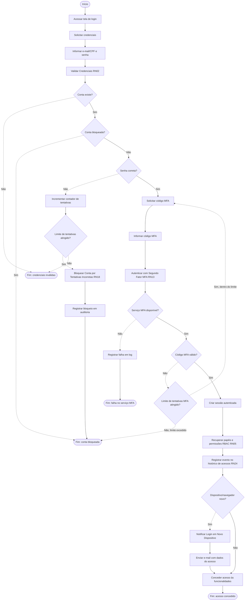

---

# UC03 - Encerrar Sessão (Logout)

## Resumo

- **Objetivo:** Encerrar voluntariamente (ou por expiração) a sessão autenticada do usuário.
- **Ator:** Usuário (principal); Sistema (secundário).
- **Fluxo principal:** Usuário solicita logout → sistema invalida sessão e tokens → remove credenciais locais → registra encerramento → redireciona para login.
- **Fluxos alternativos:** Encerramento automático por expiração/inatividade (FA02); sessão já expirada ao clicar em logout (FA01).
- **Exceções:** Sessão não encontrada (FE01); falha na invalidação da sessão (FE02).

## Diagrama em Mermaid

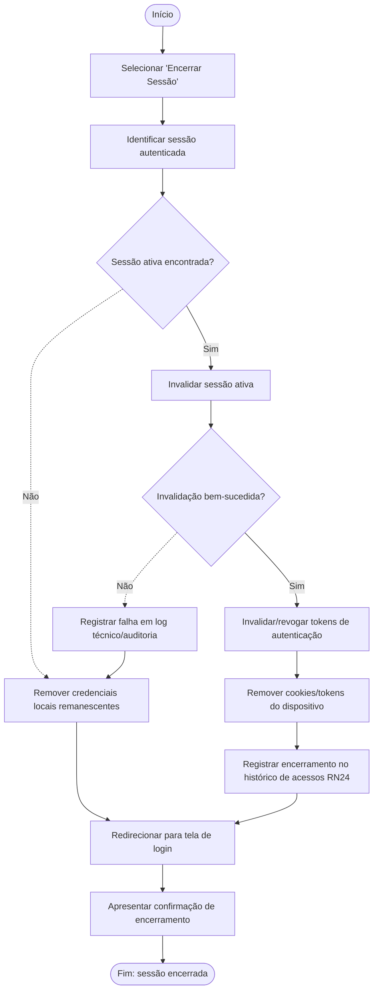

---

# UC04 - Recuperar Senha

## Resumo

- **Objetivo:** Permitir a redefinição da senha mediante validação de identidade por código OTP enviado por e-mail.
- **Ator:** Usuário (principal); Sistema, Serviço de E-mail, Serviço de OTP (secundários).
- **Fluxo principal:** Usuário informa identificador → sistema gera e envia OTP → usuário informa código → sistema valida → usuário define nova senha → sistema aplica política de segurança e confirma.
- **Fluxos alternativos:** Reenvio de código OTP (FA01); cancelamento da solicitação (FA02).
- **Exceções:** Usuário não localizado (FE01); código inválido (FE02); código expirado (FE03); limite de tentativas excedido (FE04); nova senha inválida (FE05); falha no envio do OTP (FE06).

## Diagrama em Mermaid

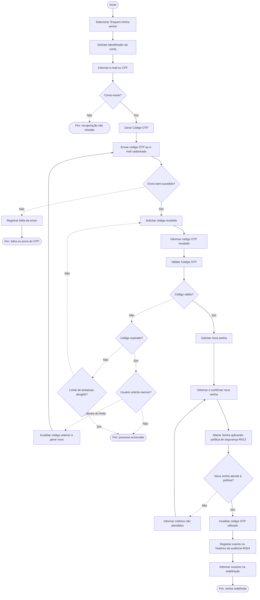

---

# UC05 - Alterar Senha

## Resumo

- **Objetivo:** Permitir que o usuário autenticado altere sua senha, validando a senha atual e a política de segurança.
- **Ator:** Usuário (principal); Sistema (secundário).
- **Fluxo principal:** Usuário informa senha atual, nova senha e confirmação → sistema valida credencial atual → valida política de segurança e reutilização → substitui a senha → encerra demais sessões → registra auditoria.
- **Fluxos alternativos:** Manter sessão atual ativa (FA01); cancelamento da alteração (FA02).
- **Exceções:** Senha atual incorreta (FE01); confirmação divergente (FE02); nova senha não atende à política (FE03); reutilização de senha anterior (FE04); limite de tentativas excedido (FE05); falha na atualização (FE06).

> ⚠️ **Nota de aderência ao protótipo:** não há tela de alteração de senha implementada em `Profile.tsx`. Diagrama modelado conforme a especificação.

## Diagrama em Mermaid

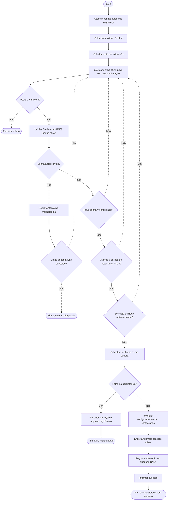

---

# UC06 - Consultar Histórico Individual de Acessos

## Resumo

- **Objetivo:** Permitir que o usuário consulte o histórico de acessos de sua própria conta.
- **Ator:** Usuário (principal); Sistema (secundário).
- **Fluxo principal:** Usuário acessa a funcionalidade → sistema recupera registros de auditoria da conta → ordena e apresenta o histórico.
- **Fluxos alternativos:** Aplicação de filtros (FA01); paginação de resultados (FA02).
- **Exceções:** Histórico inexistente (FE01); falha na recuperação (FE02); tentativa de acesso a registros de outro usuário (FE03).

> ⚠️ **Nota de aderência ao protótipo:** funcionalidade não implementada no protótipo atual (sem tela de histórico de acessos). Diagrama modelado integralmente a partir da especificação.

## Diagrama em Mermaid

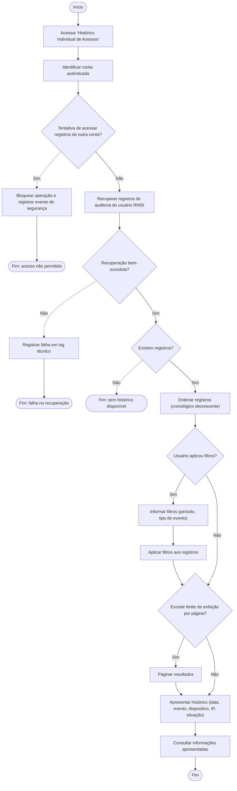

---

# UC07 - Visualizar Termos de Privacidade

## Resumo

- **Objetivo:** Permitir que o paciente consulte a versão vigente (ou anterior) do Termo de Privacidade.
- **Ator:** Paciente (principal); Sistema (secundário).
- **Fluxo principal:** Paciente acessa a opção → sistema recupera o termo vigente → apresenta conteúdo e metadados (versão, datas, finalidades).
- **Fluxos alternativos:** Consulta de versão anterior do termo (FA01).
- **Exceções:** Termo não disponível (FE01); falha na recuperação do documento (FE02).

## Diagrama em Mermaid

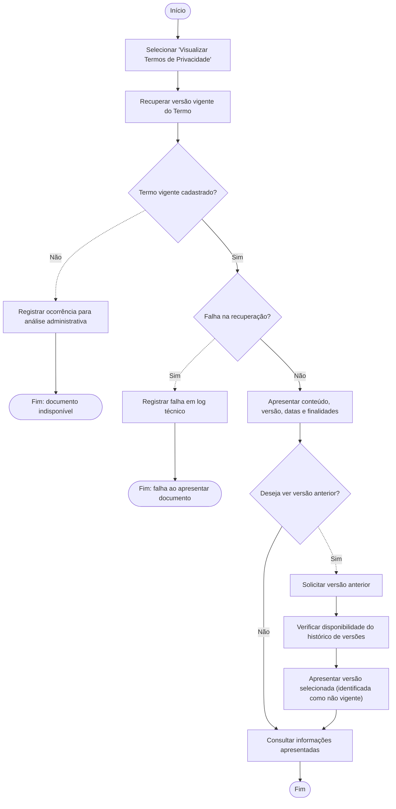

---

# UC08 - Gerenciar Consentimentos de Dados

## Resumo

- **Objetivo:** Permitir que o paciente consulte, conceda ou revogue consentimentos de tratamento de dados (LGPD).
- **Ator:** Paciente (principal); Sistema (secundário).
- **Fluxo principal:** Paciente seleciona finalidade → visualiza o Termo → concede consentimento → sistema registra manifestação e auditoria.
- **Fluxos alternativos:** Consultar histórico de consentimentos (FA01); cancelar a concessão (FA02); consentimento já concedido (FA03).
- **Exceções:** Revogar autorização (FE01, extend); solicitar portabilidade (FE02, extend); Termo de Privacidade indisponível (FE03); falha no registro (FE04); finalidade indisponível (FE05).

## Diagrama em Mermaid

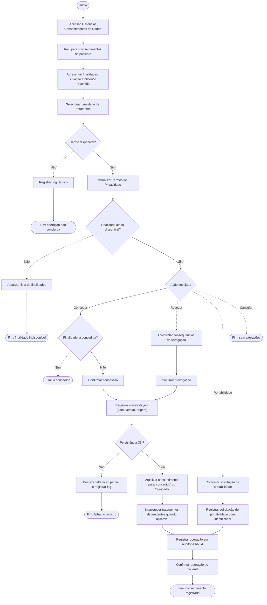

---

# UC09 - Manter Dados Cadastrais

## Resumo

- **Objetivo:** Permitir que o paciente consulte e atualize seus dados cadastrais.
- **Ator:** Paciente (principal); Sistema (secundário).
- **Fluxo principal:** Paciente consulta dados → edita campos → sistema valida → salva e registra a alteração.
- **Fluxos alternativos:** Cancelar edição (FA01); apenas consultar sem editar (FA02).
- **Exceções:** Campo obrigatório ausente (FE01); dado inválido (FE02); falha ao salvar (FE03).

## Diagrama em Mermaid

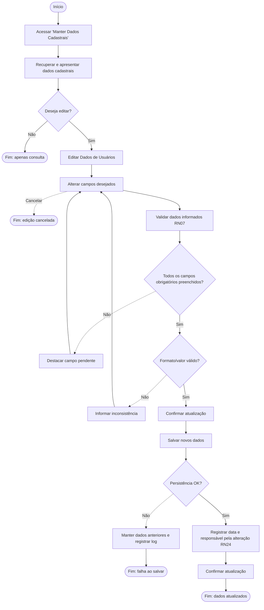

---

# UC10 - Gerenciar Contas de Usuários

## Resumo

- **Objetivo:** Permitir que o administrador consulte, edite e desative contas de usuários.
- **Ator:** Administrador (principal); Sistema (secundário).
- **Fluxo principal:** Administrador pesquisa usuário → seleciona conta → edita dados → sistema valida e salva com registro de auditoria.
- **Fluxos alternativos:** Desativar usuário (FA01); cancelar operação (FA02).
- **Exceções:** Acesso não autorizado (FE01); usuário não encontrado (FE02); dados obrigatórios ausentes (FE03); falha na atualização (FE04).

> ⚠️ **Nota de aderência ao protótipo:** não há painel administrativo implementado. Diagrama modelado a partir da especificação.

## Diagrama em Mermaid

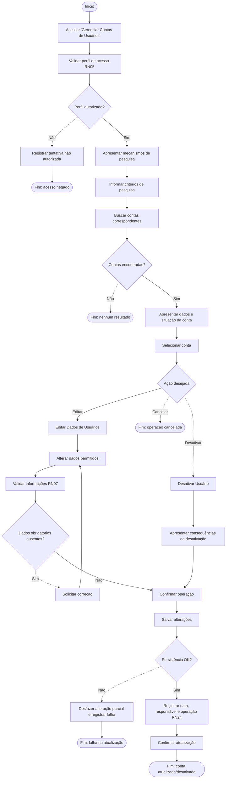

---

# UC11 - Gerenciar Permissões de Acesso

## Resumo

- **Objetivo:** Permitir que o administrador atribua papéis e perfis (RBAC) aos usuários.
- **Ator:** Administrador (principal); Sistema (secundário).
- **Fluxo principal:** Administrador seleciona usuário → sistema apresenta papéis atuais → administrador atribui/remove papéis → sistema valida e atualiza permissões.
- **Fluxos alternativos:** Remover papel/perfil (FA01); cancelar alteração (FA02).
- **Exceções:** Acesso não autorizado (FE01); atribuição inconsistente (FE02); falha na atualização (FE03).

> ⚠️ **Nota de aderência ao protótipo:** funcionalidade não implementada (não há modelo de papéis/RBAC no protótipo). Diagrama modelado a partir da especificação.

## Diagrama em Mermaid

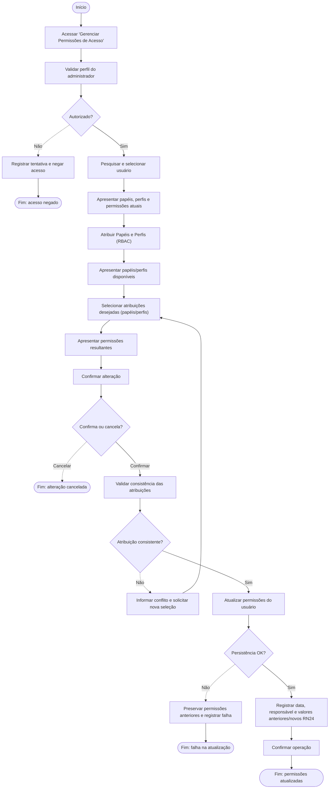

---

# UC12 - Consultar Histórico Geral de Acessos

## Resumo

- **Objetivo:** Permitir que o administrador consulte os registros gerais de acesso para auditoria e segurança.
- **Ator:** Administrador (principal); Sistema (secundário).
- **Fluxo principal:** Administrador informa filtros → sistema valida e recupera registros → apresenta dados de auditoria.
- **Fluxos alternativos:** Consultar sem filtros (FA01); refinar pesquisa (FA02).
- **Exceções:** Acesso não autorizado (FE01); período inválido (FE02); nenhum registro encontrado (FE03); falha na consulta (FE04).

> ⚠️ **Nota de aderência ao protótipo:** funcionalidade não implementada no protótipo atual. Diagrama modelado a partir da especificação.

## Diagrama em Mermaid

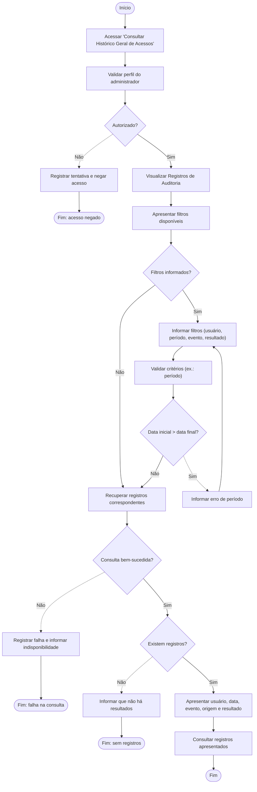

---

# Módulo 2 - Triagem Inteligente, Chatbot e Documentos

# UC13 - Iniciar Sessão de Pré-Triagem

## Resumo

- **Objetivo:** Permitir que o paciente inicie a pré-triagem e descreva sintomas em linguagem natural.
- **Ator:** Paciente (principal); Sistema (secundário).
- **Fluxo principal:** Paciente inicia sessão → sistema cria sessão de triagem → paciente descreve sintomas → sistema registra e analisa o conteúdo.
- **Fluxos alternativos:** Retomar sessão pausada (FA01); cancelar antes de enviar (FA02).
- **Exceções:** Indício de emergência (FE01); descrição ausente (FE02); falha ao criar sessão (FE03).
- Alinhado ao protótipo: `TriageChat.tsx` implementa detecção de emergência por palavras-chave (192) e mensagem inicial do assistente.

## Diagrama em Mermaid

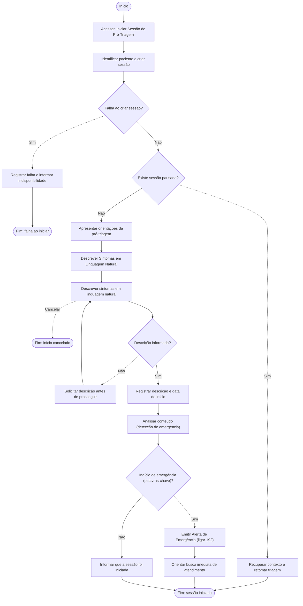

---

# UC14 - Anexar Exames e Documentos

## Resumo

- **Objetivo:** Permitir que o paciente anexe exames/documentos à pré-triagem.
- **Ator:** Paciente (principal); Sistema (secundário, com processamento assíncrono).
- **Fluxo principal:** Paciente seleciona arquivo → sistema valida formato/tamanho → armazena e vincula à triagem → processa de forma assíncrona.
- **Fluxos alternativos:** Anexar mais de um documento (FA01); cancelar envio (FA02).
- **Exceções:** Arquivo inválido (FE01); exame sem paciente válido (FE02); falha no processamento (FE03).

## Diagrama em Mermaid

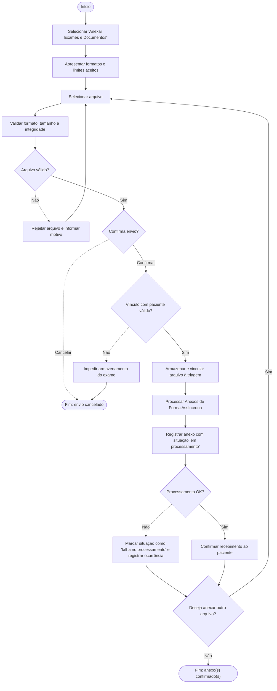

---

# UC15 - Pausar Triagem

## Resumo

- **Objetivo:** Permitir que o paciente interrompa temporariamente a pré-triagem, preservando o progresso.
- **Ator:** Paciente (principal); Sistema (secundário).
- **Fluxo principal:** Paciente solicita pausa → sistema confirma → salva respostas/anexos → altera situação para "pausada".
- **Fluxos alternativos:** Desistir da pausa (FA01).
- **Exceções:** Sessão já encerrada (FE01); falha ao salvar progresso (FE02).

> ⚠️ **Nota de aderência ao protótipo:** o fluxo de triagem em `TriageChat.tsx` é linear e não implementa pausa/retomada. Diagrama modelado a partir da especificação, representando lacuna a implementar.

## Diagrama em Mermaid

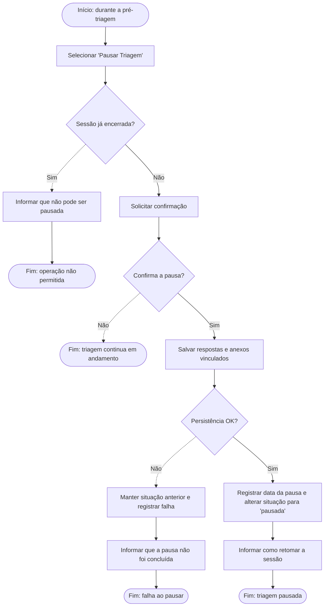

---

# UC16 - Visualizar Resumo da Triagem

## Resumo

- **Objetivo:** Permitir que o paciente revise as informações antes de confirmar a pré-triagem.
- **Ator:** Paciente (principal); Sistema (secundário).
- **Fluxo principal:** Paciente solicita o resumo → sistema recupera e organiza sintomas/respostas/anexos → apresenta opções de correção ou confirmação.
- **Fluxos alternativos:** Corrigir informação (FA01); recomendar especialidade quando há dados suficientes (FA02).
- **Exceções:** Triagem sem informações suficientes (FE01); falha na recuperação (FE02).

## Diagrama em Mermaid

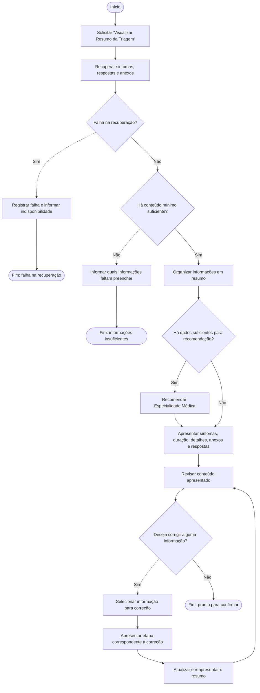

---

# UC17 - Confirmar Resumo da Triagem

## Resumo

- **Objetivo:** Permitir que o paciente confirme o resumo, habilitando a classificação de urgência e o relatório.
- **Ator:** Paciente (principal); Sistema (secundário).
- **Fluxo principal:** Paciente confirma o resumo → sistema valida campos obrigatórios → registra a confirmação → classifica o nível de urgência.
- **Fluxos alternativos:** Voltar para correção (FA01).
- **Exceções:** Informação obrigatória ausente (FE01); emergência identificada (FE02); falha na classificação (FE03).
- Alinhado ao protótipo: `classifyPriority()` em `triageEngine.ts` define baixa/média/alta/emergência.

## Diagrama em Mermaid

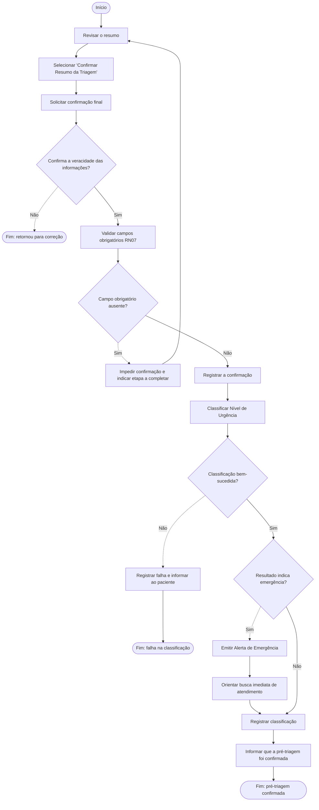

---

# UC18 - Responder Perguntas Adaptativas

## Resumo

- **Objetivo:** Coletar detalhes dos sintomas por meio de perguntas adaptadas ao contexto informado.
- **Ator:** Paciente (principal); Sistema (secundário).
- **Fluxo principal:** Sistema analisa o contexto → adapta e apresenta pergunta → paciente responde → sistema valida, registra e atualiza o contexto (loop até esgotar os detalhes relevantes).
- **Fluxos alternativos:** Paciente não sabe responder (FA01); pausar triagem (FA02).
- **Exceções:** Resposta inválida (FE01); indício de emergência (FE02); falha ao registrar resposta (FE03).
- Alinhado ao protótipo: 4 perguntas sequenciais (duração, intensidade, histórico, anexos) com opções "Não sei".

## Diagrama em Mermaid

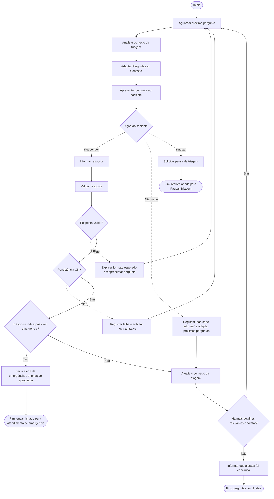

---

# UC19 - Visualizar Relatório de Pré-Triagem

## Resumo

- **Objetivo:** Permitir que o médico autorizado visualize o relatório da pré-triagem antes da consulta.
- **Ator:** Médico (principal); Sistema (secundário).
- **Fluxo principal:** Médico seleciona paciente/atendimento → sistema recupera triagem confirmada → gera e apresenta o relatório.
- **Fluxos alternativos:** Selecionar outra triagem (FA01).
- **Exceções:** Acesso não autorizado (FE01); triagem não confirmada (FE02); falha na geração (FE03).

> ⚠️ **Nota de aderência ao protótipo:** não há interface do Médico implementada (`TriageResult.tsx` é exibido apenas ao paciente). Diagrama modelado a partir da especificação.

## Diagrama em Mermaid

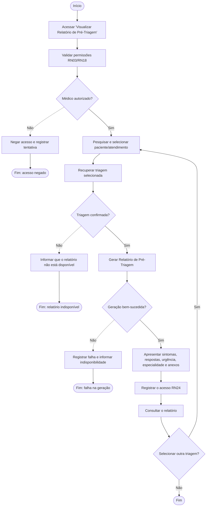

---

# UC20 - Visualizar Anexos e Documentos da Triagem

## Resumo

- **Objetivo:** Permitir que o médico autorizado consulte exames e documentos vinculados à pré-triagem.
- **Ator:** Médico (principal); Sistema (secundário).
- **Fluxo principal:** Médico seleciona paciente/triagem → sistema lista anexos → médico seleciona um anexo → sistema apresenta o documento.
- **Fluxos alternativos:** Consultar outro anexo (FA01).
- **Exceções:** Acesso não autorizado (FE01); nenhum anexo (FE02); processamento pendente/com falha (FE03); falha na recuperação (FE04).

> ⚠️ **Nota de aderência ao protótipo:** não há interface do Médico implementada. Diagrama modelado a partir da especificação.

## Diagrama em Mermaid

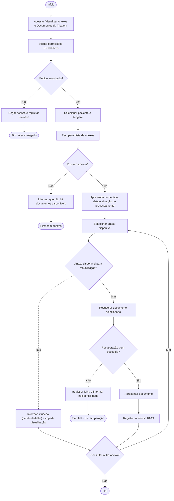

---

# Módulo 3 - Atendimento Médico, Agendamento e Prontuário Eletrônico

# UC21 - Agendar Consulta

## Resumo

- **Objetivo:** Permitir que o paciente agende uma consulta com um profissional em horário disponível.
- **Ator:** Paciente (principal); Sistema (secundário).
- **Fluxo principal:** Paciente informa especialidade/profissional → sistema consulta horários disponíveis → paciente escolhe horário e confirma → sistema registra e programa lembrete.
- **Fluxos alternativos:** Alterar critérios de busca (FA01); cancelar antes da confirmação (FA02).
- **Exceções:** Nenhum horário disponível (FE01); horário ocupado na confirmação (FE02); falha no registro (FE03).
- Alinhado ao protótipo: `Scheduling.tsx` implementa assistente de 4 passos (especialidade → profissional → modalidade/data/hora → confirmação).

## Diagrama em Mermaid

```mermaid
flowchart TD
    A1(["Início"]) --> A2["Acessar 'Agendar Consulta'"]
    A2 --> B1["Solicitar critérios de atendimento"]
    B1 --> A3["Informar especialidade/profissional/critérios"]
    A3 --> B2["Consultar Horários Disponíveis"]
    B2 --> B3{"Existem horários disponíveis?"}
    B3 -.->|"Não"| B4["Informar indisponibilidade"]
    B4 --> A3
    B3 -->|"Sim"| B5["Apresentar horários disponíveis"]
    B5 --> A4["Selecionar horário disponível"]
    A4 --> B6["Reapresentar dados para confirmação"]
    B6 --> A5{"Confirma o agendamento?"}
    A5 -.->|"Cancelar"| A6(["Fim: agendamento cancelado"])
    A5 -->|"Confirmar"| B7["Verificar disponibilidade novamente"]
    B7 --> B8{"Horário ainda disponível?"}
    B8 -.->|"Não"| B9["Não realizar agendamento e atualizar lista"]
    B9 --> B5
    B8 -->|"Sim"| B10["Registrar paciente, profissional, data, horário RN21"]
    B10 --> B11{"Persistência OK?"}
    B11 -.->|"Não"| B12["Liberar horário e registrar falha"]
    B12 --> B13(["Fim: falha no agendamento"])
    B11 -->|"Sim"| B14["Disparar Lembrete Automático de Consulta RN23"]
    B14 --> B15["Confirmar agendamento"]
    B15 --> A7(["Fim: consulta agendada"])
```

---

# UC22 - Reagendar Consulta

## Resumo

- **Objetivo:** Permitir que o paciente altere a data/horário de uma consulta já agendada.
- **Ator:** Paciente (principal); Sistema (secundário).
- **Fluxo principal:** Paciente seleciona consulta → sistema consulta novos horários → paciente escolhe e confirma → sistema atualiza a consulta e o lembrete.
- **Fluxos alternativos:** Cancelar reagendamento (FA01); pesquisar outro período (FA02).
- **Exceções:** Consulta não elegível (FE01); novo horário indisponível (FE02); falha na atualização (FE03).
- Alinhado ao protótipo: `AppointmentDetail.tsx` implementa reagendamento (grade de horários para a mesma data).

## Diagrama em Mermaid

```mermaid
flowchart TD
    A1(["Início"]) --> A2["Visualizar consultas agendadas (Visualizar Consultas Agendadas)"]
    A2 --> A3["Selecionar consulta e solicitar 'Reagendar Consulta'"]
    A3 --> B1{"Consulta pode ser reagendada?"}
    B1 -.->|"Não"| B2["Impedir a operação e informar o motivo"]
    B2 --> B3(["Fim: consulta não elegível"])
    B1 -->|"Sim"| B4["Consultar Horários Disponíveis"]
    B4 --> B5["Apresentar novos horários"]
    B5 --> A4["Selecionar novo horário"]
    A4 --> B6["Apresentar dados anteriores e novos"]
    B6 --> A5{"Confirma o reagendamento?"}
    A5 -.->|"Cancelar"| A6(["Fim: reagendamento cancelado"])
    A5 -->|"Confirmar"| B7["Verificar disponibilidade novamente"]
    B7 --> B8{"Novo horário ainda disponível?"}
    B8 -.->|"Não"| B9["Manter horário original e apresentar opções atualizadas"]
    B9 --> B5
    B8 -->|"Sim"| B10["Atualizar a consulta de forma atômica"]
    B10 --> B11{"Persistência OK?"}
    B11 -.->|"Não"| B12["Restaurar situação original e registrar falha"]
    B12 --> B13(["Fim: falha na atualização"])
    B11 -->|"Sim"| B14["Registrar data e responsável RN24"]
    B14 --> B15["Atualizar lembrete automático"]
    B15 --> B16["Confirmar reagendamento"]
    B16 --> A7(["Fim: consulta reagendada"])
```

---

# UC23 - Cancelar Consulta

## Resumo

- **Objetivo:** Permitir que o paciente cancele uma consulta futura, liberando o horário.
- **Ator:** Paciente (principal); Sistema (secundário).
- **Fluxo principal:** Paciente seleciona a consulta → sistema apresenta consequências → paciente confirma → sistema cancela, libera o horário e o lembrete.
- **Fluxos alternativos:** Desistir do cancelamento (FA01).
- **Exceções:** Consulta não elegível (FE01); falha no cancelamento (FE02).
- Alinhado ao protótipo: `AppointmentDetail.tsx` implementa diálogo de confirmação de cancelamento.

## Diagrama em Mermaid

```mermaid
flowchart TD
    A1(["Início"]) --> A2["Visualizar consultas agendadas"]
    A2 --> A3["Selecionar consulta e solicitar 'Cancelar Consulta'"]
    A3 --> B1{"Consulta pode ser cancelada?"}
    B1 -.->|"Não"| B2["Impedir operação e atualizar situação apresentada"]
    B2 --> B3(["Fim: consulta não elegível"])
    B1 -->|"Sim"| B4["Apresentar dados e consequências do cancelamento"]
    B4 --> B5["Solicitar confirmação"]
    B5 --> A4{"Confirma o cancelamento?"}
    A4 -.->|"Não"| A5(["Fim: consulta mantida"])
    A4 -->|"Sim"| B6["Alterar situação da consulta para 'cancelada'"]
    B6 --> B7{"Persistência OK?"}
    B7 -.->|"Não"| B8["Manter situação anterior e registrar falha"]
    B8 --> B9(["Fim: falha no cancelamento"])
    B7 -->|"Sim"| B10["Liberar o horário do profissional"]
    B10 --> B11["Cancelar lembretes pendentes"]
    B11 --> B12["Registrar data e responsável RN24"]
    B12 --> B13["Confirmar o cancelamento"]
    B13 --> A6(["Fim: consulta cancelada"])
```

---

# UC24 - Visualizar Consultas Agendadas

## Resumo

- **Objetivo:** Permitir que o paciente consulte suas consultas futuras e detalhes.
- **Ator:** Paciente (principal); Sistema (secundário).
- **Fluxo principal:** Paciente acessa a lista → sistema recupera as consultas futuras → paciente seleciona uma consulta → sistema apresenta detalhes e ações.
- **Fluxos alternativos:** Reagendar (FA01, extend UC22); cancelar (FA02, extend UC23).
- **Exceções:** Nenhuma consulta agendada (FE01); falha na consulta (FE02).
- Alinhado ao protótipo: `AppointmentsList.tsx` com abas "Próximas"/"Anteriores".

## Diagrama em Mermaid

```mermaid
flowchart TD
    A1(["Início"]) --> A2["Acessar 'Visualizar Consultas Agendadas'"]
    A2 --> B1["Identificar o paciente"]
    B1 --> B2["Recuperar consultas futuras"]
    B2 --> B3{"Recuperação bem-sucedida?"}
    B3 -.->|"Não"| B4["Registrar falha e informar indisponibilidade"]
    B4 --> B5(["Fim: falha na consulta"])
    B3 -->|"Sim"| B6{"Existem consultas futuras?"}
    B6 -.->|"Não"| B7["Informar que não há consultas agendadas"]
    B7 --> B8(["Fim: sem consultas"])
    B6 -->|"Sim"| B9["Apresentar data, horário, profissional, especialidade, modalidade e situação"]
    B9 --> A3["Selecionar uma consulta"]
    A3 --> B10["Apresentar detalhes e ações disponíveis"]
    B10 --> A4{"Ação desejada"}
    A4 -.->|"Reagendar"| B11["Executar extensão Reagendar Consulta"]
    B11 --> A5(["Fim: consulta"])
    A4 -.->|"Cancelar"| B12["Executar extensão Cancelar Consulta"]
    B12 --> A5
    A4 -->|"Apenas consultar"| A5
```

---

# UC25 - Visualizar Resultados de Exames

## Resumo

- **Objetivo:** Permitir que o paciente consulte resultados de exames vinculados ao seu prontuário.
- **Ator:** Paciente (principal); Sistema (secundário).
- **Fluxo principal:** Paciente acessa a funcionalidade → sistema recupera exames vinculados → paciente seleciona um resultado → sistema valida vínculo e apresenta o resultado.
- **Fluxos alternativos:** Novo resultado disponível → notificação (FA01); filtrar exames (FA02).
- **Exceções:** Resultado pendente (FE01); vínculo inválido (FE02); falha na recuperação (FE03).
- Alinhado ao protótipo: `HistoryDetail.tsx` apresenta exames com status "Disponível"/"Pendente".

## Diagrama em Mermaid

```mermaid
flowchart TD
    A1(["Início"]) --> A2["Acessar 'Visualizar Resultados de Exames'"]
    A2 --> B1["Identificar o paciente"]
    B1 --> B2["Recuperar exames vinculados ao prontuário"]
    B2 --> B3["Apresentar exame, data, situação e responsável"]
    B3 --> B4{"Paciente aplicou filtro?"}
    B4 -.->|"Sim"| A3["Informar período/tipo"]
    A3 --> B5["Reapresentar lista filtrada"]
    B5 --> A4["Selecionar um resultado disponível"]
    B4 -->|"Não"| A4
    A4 --> B6{"Vínculo com o paciente autenticado é válido?"}
    B6 -.->|"Não"| B7["Negar acesso e registrar tentativa"]
    B7 --> B8(["Fim: acesso negado"])
    B6 -->|"Sim"| B9{"Resultado já foi liberado?"}
    B9 -.->|"Não"| B10["Informar situação sem apresentar conteúdo clínico"]
    B10 --> B11(["Fim: resultado pendente"])
    B9 -->|"Sim"| B12{"Recuperação bem-sucedida?"}
    B12 -.->|"Não"| B13["Registrar falha e informar indisponibilidade"]
    B13 --> B14(["Fim: falha na recuperação"])
    B12 -->|"Sim"| B15["Apresentar resultado e documentos associados"]
    B15 --> B16["Registrar o acesso"]
    B16 --> A5(["Fim"])
    B3 --> B17{"Novo resultado foi vinculado?"}
    B17 -.->|"Sim"| B18["Notificar Paciente sobre Novo Resultado"]
```

---

# UC26 - Abrir Prontuário Eletrônico

## Resumo

- **Objetivo:** Permitir que o médico autorizado acesse o prontuário e o histórico clínico de um paciente.
- **Ator:** Médico (principal); Sistema (secundário).
- **Fluxo principal:** Médico seleciona paciente → sistema valida vínculo → recupera prontuário e histórico clínico → apresenta dados e registra o acesso.
- **Fluxos alternativos:** Selecionar atendimento anterior (FA01).
- **Exceções:** Acesso não autorizado (FE01); paciente não encontrado (FE02); paciente sem cadastro válido (FE03); falha na recuperação (FE04).

> ⚠️ **Nota de aderência ao protótipo:** não há interface do Médico implementada. Diagrama modelado a partir da especificação.

## Diagrama em Mermaid

```mermaid
flowchart TD
    A1(["Início"]) --> A2["Acessar 'Abrir Prontuário Eletrônico'"]
    A2 --> B1["Validar perfil e permissões RN03"]
    B1 --> B2{"Médico autorizado?"}
    B2 -.->|"Não"| B3["Negar acesso e registrar tentativa"]
    B3 --> B4(["Fim: acesso negado"])
    B2 -->|"Sim"| A3["Pesquisar e selecionar paciente"]
    A3 --> B5{"Paciente encontrado?"}
    B5 -.->|"Não"| B6["Informar que não encontrou resultados"]
    B6 --> B7(["Fim: paciente não encontrado"])
    B5 -->|"Sim"| B8["Validar cadastro e vínculo de acesso RN16"]
    B8 --> B9{"Cadastro válido?"}
    B9 -.->|"Não"| B10["Impedir abertura do prontuário"]
    B10 --> B11(["Fim: cadastro inválido"])
    B9 -->|"Sim"| B12["Recuperar prontuário"]
    B12 --> B13{"Recuperação bem-sucedida?"}
    B13 -.->|"Não"| B14["Registrar falha e informar indisponibilidade"]
    B14 --> B15(["Fim: falha na recuperação"])
    B13 -->|"Sim"| B16["Consultar Histórico Clínico Anterior RN11"]
    B16 --> B17["Apresentar dados clínicos, atendimentos, exames e prescrições"]
    B17 --> B18["Registrar médico, paciente, data e horário do acesso"]
    B18 --> A4["Consultar dados apresentados"]
    A4 --> A5{"Selecionar atendimento anterior?"}
    A5 -.->|"Sim"| B19["Apresentar detalhes do atendimento selecionado"]
    B19 --> A6(["Fim"])
    A5 -->|"Não"| A6
```

---

# UC27 - Registrar Observações Clínicas

## Resumo

- **Objetivo:** Permitir que o médico registre observações clínicas do atendimento, com versionamento e rastreabilidade.
- **Ator:** Médico (principal); Sistema (secundário).
- **Fluxo principal:** Médico registra observações → sistema valida campos → versiona o prontuário → salva com data e responsável.
- **Fluxos alternativos:** Registrar hipótese diagnóstica (FA01); emitir prescrição (FA02); solicitar exames (FA03); encaminhar para especialista (FA04).
- **Exceções:** Profissional não autorizado (FE01); campo obrigatório ausente (FE02); falha no versionamento (FE03).

> ⚠️ **Nota de aderência ao protótipo:** não há interface do Médico implementada. Diagrama modelado a partir da especificação.

## Diagrama em Mermaid

```mermaid
flowchart TD
    A1(["Início"]) --> A2["Abrir o prontuário do paciente"]
    A2 --> A3["Selecionar 'Registrar Observações Clínicas'"]
    A3 --> B1{"Médico autorizado para o atendimento?"}
    B1 -.->|"Não"| B2["Negar operação e registrar tentativa"]
    B2 --> B3(["Fim: não autorizado"])
    B1 -->|"Sim"| B4["Apresentar campos clínicos"]
    B4 --> A4["Registrar observações clínicas"]
    A4 --> A5{"Ação adicional desejada"}
    A5 -.->|"Hipótese diagnóstica"| B14["Registrar Hipótese Diagnóstica"]
    B14 --> A4
    A5 -.->|"Prescrição"| B15["Emitir Prescrição Médica Digital"]
    B15 --> A4
    A5 -.->|"Exames"| B16["Solicitar Exames Complementares"]
    B16 --> A4
    A5 -.->|"Encaminhamento"| B17["Encaminhar para Especialista"]
    B17 --> A4
    A5 -->|"Concluir registro"| B5["Validar informações obrigatórias RN07"]
    B5 --> B6{"Campo obrigatório ausente?"}
    B6 -.->|"Sim"| B7["Impedir salvamento e solicitar correção"]
    B7 --> A4
    B6 -->|"Não"| B8["Versionar Alterações do Prontuário"]
    B8 --> B9{"Versionamento bem-sucedido?"}
    B9 -.->|"Não"| B10["Cancelar salvamento e manter prontuário anterior"]
    B10 --> B11(["Fim: falha no versionamento"])
    B9 -->|"Sim"| B12["Salvar com data, horário e médico responsável RN24"]
    B12 --> B13["Atualizar histórico e confirmar registro"]
    B13 --> A7(["Fim: registro concluído"])
```

---

# UC28 - Registrar Necessidade de Retorno

## Resumo

- **Objetivo:** Permitir que o médico registre a necessidade de retorno do paciente após o atendimento.
- **Ator:** Médico (principal); Sistema (secundário).
- **Fluxo principal:** Médico informa prazo/orientação de retorno → sistema valida e registra no atendimento.
- **Fluxos alternativos:** Retorno sem data definida (FA01); cancelar registro (FA02).
- **Exceções:** Informação obrigatória ausente (FE01); atendimento encerrado (FE02); falha no registro (FE03).

> ⚠️ **Nota de aderência ao protótipo:** não há interface do Médico implementada. Diagrama modelado a partir da especificação.

## Diagrama em Mermaid

```mermaid
flowchart TD
    A1(["Início: durante o atendimento"]) --> A2["Selecionar 'Registrar Necessidade de Retorno'"]
    A2 --> B1{"Atendimento já foi concluído?"}
    B1 -.->|"Sim"| B2["Impedir a alteração pelo fluxo atual"]
    B2 --> B3(["Fim: atendimento encerrado"])
    B1 -->|"Não"| B4["Apresentar campos de prazo e orientação"]
    B4 --> A3["Informar prazo ou condição clínica de retorno"]
    A3 --> A4{"Confirma o registro?"}
    A4 -.->|"Cancelar"| A5(["Fim: registro cancelado"])
    A4 -->|"Confirmar"| B5["Validar campos obrigatórios RN07"]
    B5 --> B6{"Campo obrigatório ausente?"}
    B6 -.->|"Sim"| B7["Solicitar correção e não salvar"]
    B7 --> A3
    B6 -->|"Não"| B8["Registrar necessidade de retorno no atendimento"]
    B8 --> B9{"Persistência OK?"}
    B9 -.->|"Não"| B10["Manter estado anterior e registrar falha"]
    B10 --> B11(["Fim: falha no registro"])
    B9 -->|"Sim"| B12["Registrar data e médico responsável RN24"]
    B12 --> B13["Confirmar a operação"]
    B13 --> A6(["Fim: retorno registrado"])
```

---

# UC29 - Concluir Atendimento

## Resumo

- **Objetivo:** Permitir que o médico finalize o atendimento, registre as observações clínicas pendentes e atualize o histórico do paciente.
- **Ator:** Médico (principal); Sistema (secundário).
- **Fluxo principal:** Médico solicita a conclusão → sistema verifica informações obrigatórias → apresenta resumo → médico confirma → sistema altera situação para "concluído" e gera o histórico.
- **Fluxos alternativos:** Registrar necessidade de retorno (FA01, extend UC28); voltar ao atendimento sem confirmar (FA02).
- **Exceções:** Informação obrigatória ausente (FE01); atendimento já concluído (FE02); falha na atualização do histórico (FE03).
- Alinhado ao protótipo: `Teleconsult.tsx` finaliza a chamada gerando automaticamente um `MedicalRecord` (implementação simplificada, sem validação clínica detalhada).

> ⚠️ **Nota de aderência ao protótipo:** o protótipo simplifica a conclusão do atendimento (gera prontuário automático ao encerrar a teleconsulta); o diagrama segue a especificação completa (registro de observações, verificação de pendências e confirmação).

## Diagrama em Mermaid

```mermaid
flowchart TD
    A1(["Início"]) --> A2["Selecionar 'Concluir Atendimento'"]
    A2 --> B1{"Atendimento já está concluído?"}
    B1 -.->|"Sim"| B2["Impedir nova conclusão e apresentar registro existente"]
    B2 --> B3(["Fim: já concluído"])
    B1 -->|"Não"| B4["Verificar informações clínicas obrigatórias"]
    B4 --> B5{"Informação obrigatória ausente?"}
    B5 -.->|"Sim"| B6["Impedir a conclusão e indicar campos pendentes"]
    B6 --> B7["Registrar Observações Clínicas (pendências)"]
    B7 --> B4
    B5 -->|"Não"| B8["Apresentar resumo do atendimento"]
    B8 --> A3["Revisar o resumo do atendimento"]
    A3 --> A4{"Identifica necessidade de retorno?"}
    A4 -.->|"Sim"| B9["Registrar Necessidade de Retorno"]
    B9 --> B10["Solicitar confirmação"]
    A4 -->|"Não"| B10
    B10 --> A5{"Confirma a conclusão?"}
    A5 -.->|"Não"| A6(["Fim: atendimento permanece aberto"])
    A5 -->|"Sim"| B11["Alterar situação para 'concluído'"]
    B11 --> B12["Gerar registro no histórico médico RN20"]
    B12 --> B13{"Persistência OK?"}
    B13 -.->|"Não"| B14["Desfazer conclusão, manter atendimento aberto e registrar falha"]
    B14 --> B15(["Fim: falha na atualização do histórico"])
    B13 -->|"Sim"| B16["Registrar data, horário e médico responsável RN24/RN25"]
    B16 --> B17["Confirmar a conclusão"]
    B17 --> A7(["Fim: atendimento concluído"])
```
